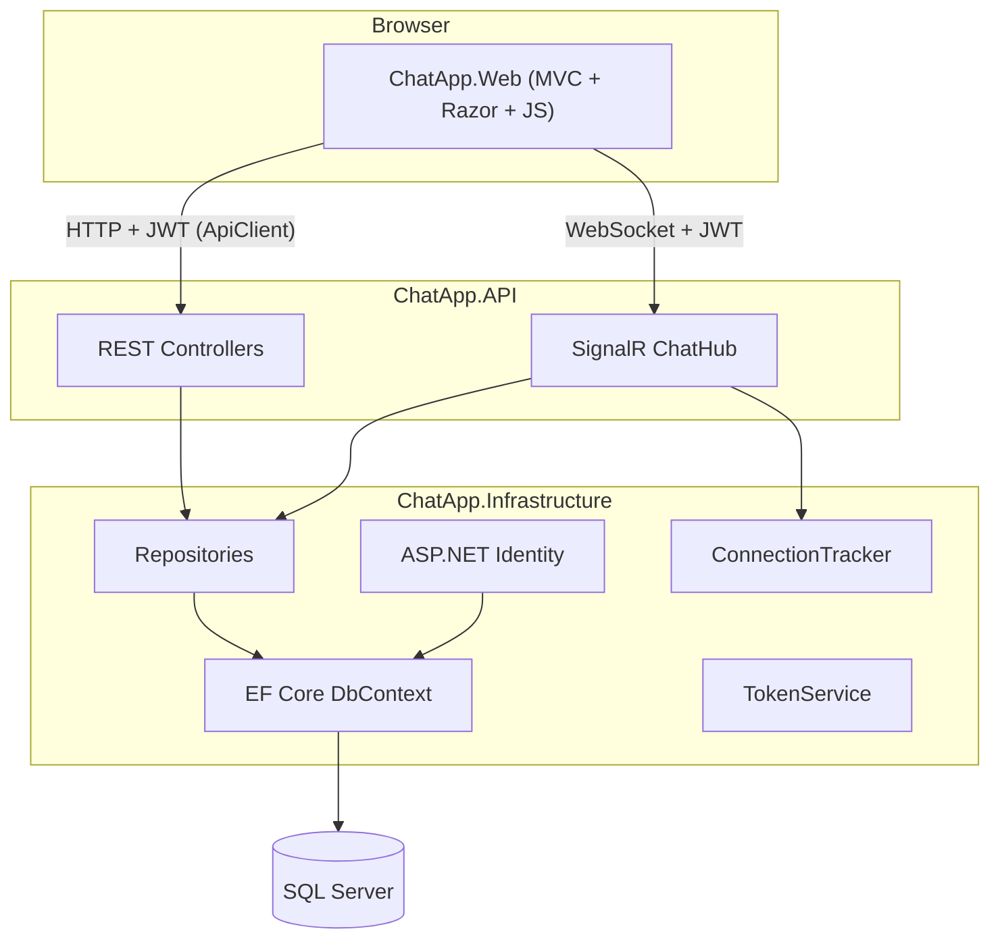
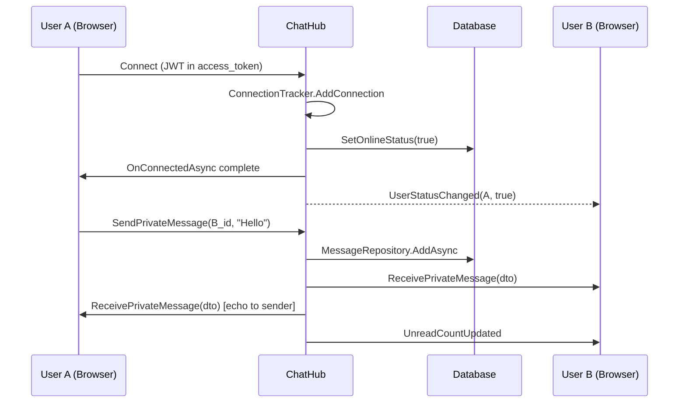
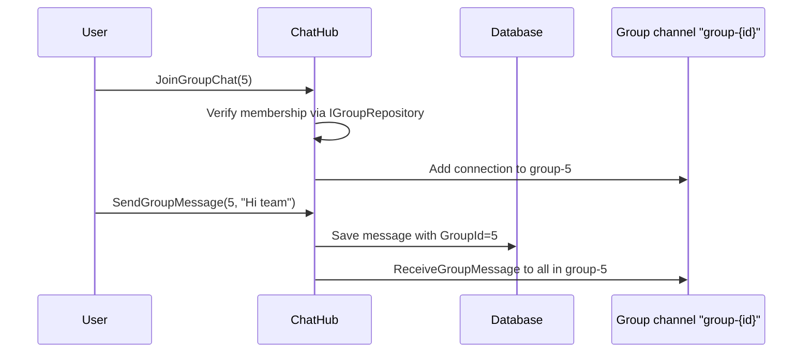
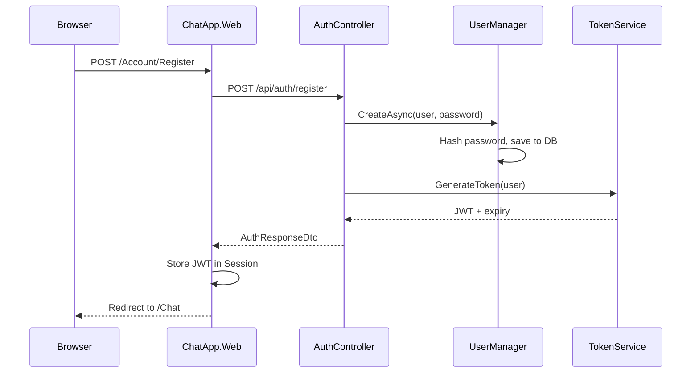

# Real-Time Chat Application — Complete Project Defense Guide

This guide covers the **entire group project** as integrated on the `dev` branch of the repository, plus features from feature branches (`authentication`, `realtime-chat`, `kaleab/database`, `frontend-ui`, `devops-docs-user-directory`). It is written so you can defend the system end-to-end in a viva.

---

## 1. System Overview

### What the system does

A **real-time chat platform** where registered users can:

- Authenticate securely with JWT
- Browse a **user directory**
- Send **private** and **group** messages in real time
- See **online/offline** status and **typing indicators**
- Load **message history** from the database
- Manage groups (create, join, leave, add members)
- Use a **responsive MVC web UI**

### High-level architecture



### Two-process deployment

| Process | Port (default) | Role |
|---------|----------------|------|
| `ChatApp.API` | `https://localhost:7244` | REST API + SignalR hub |
| `ChatApp.Web` | separate MVC port | UI, session, calls API |

The Web app does **not** talk to the database directly. It is a **client** of the API.

### Team branch contributions (how to explain group work)

| Branch | Contribution |
|--------|--------------|
| `kaleab/database` | Entities, EF Core, migrations, repositories |
| `feature/authentication` | Identity, JWT, `AuthController`, early `UsersController` |
| `feature/realtime-chat` | `ChatHub`, `ConnectionTracker`, live messaging |
| `feature/frontend-ui` | MVC UI, `chat.js`, profile, groups pages |
| `feature/devops-docs-user-directory` | `DirectoryController`, tests, CI, docs |
| `dev` | Integration branch merging all features |

---

## 2. Architecture Explanation (5 Projects)

### `ChatApp.Core` — Domain layer

**Responsibility:** Business contracts and shared models. No database, no HTTP.

Contains:

- **Entities:** `ApplicationUser`, `Message`, `ChatGroup`, `GroupMember`
- **DTOs:** Auth, Messages, Groups, Users, Chat events
- **Interfaces:** `IMessageRepository`, `IGroupRepository`, `IUserRepository`, `ITokenService`, `IConnectionTracker`
- **Common:** `ApiResponse<T>` wrapper for consistent API responses

**Why it exists:** Keeps API and Infrastructure decoupled. You can change SQL Server or EF without touching controllers.

---

### `ChatApp.Infrastructure` — Data & services layer

**Responsibility:** Implements persistence and cross-cutting services.

Contains:

- `ChatAppDbContext` (EF Core + Identity)
- **Repositories:** `MessageRepository`, `GroupRepository`, `UserRepository`
- **Services:** `TokenService`, `ConnectionTracker`, `DbSeeder`
- `DependencyInjection.cs` — wires everything into DI container

---

### `ChatApp.API` — Backend API + Real-time

**Responsibility:** HTTP endpoints, authentication, SignalR hub.

Contains:

- Controllers: `AuthController`, `MessagesController`, `GroupsController`, `DirectoryController`
- `ChatHub` at `/hubs/chat`
- `Program.cs` — JWT, CORS, SignalR, middleware pipeline

---

### `ChatApp.Web` — Frontend (MVC)

**Responsibility:** User-facing web application.

Contains:

- MVC Controllers: `AccountController`, `ChatController`, `ProfileController`, `DirectoryController`, `GroupsController`
- Razor Views
- `ApiClient` — HTTP client that attaches JWT from session
- `wwwroot/js/chat.js` — SignalR client

**Pattern:** Server-rendered pages + client-side JavaScript for real-time chat.

---

### `tests/ChatApp.Tests` — Automated tests

**Responsibility:** Validates API behavior (currently focused on Directory).

Uses **xUnit** + **Moq** for unit testing controllers in isolation.

---

## 3. Database Explanation

### ERD (text diagram)

```
┌─────────────────────────────────────────────────────────────────┐
│                    AspNetUsers (ApplicationUser)                 │
│  PK: Id (nvarchar(450))                                         │
│  ─────────────────────────────────────────────────────────────  │
│  UserName, Email, PasswordHash  (Identity fields)             │
│  IsOnline (bool)          ← presence tracking                   │
│  CreatedAt (datetime2)    ← join date                           │
└────────────┬───────────────────────────────┬────────────────────┘
             │                               │
    SentMessages (1:N)              ReceivedMessages (1:N)
             │                               │
             ▼                               ▼
┌─────────────────────────────────────────────────────────────────┐
│                         Messages                                 │
│  PK: Id (int, identity)                                         │
│  FK: SenderId   → AspNetUsers.Id     (Restrict on delete)       │
│  FK: ReceiverId → AspNetUsers.Id     (nullable, Restrict)       │
│  FK: GroupId    → ChatGroups.Id     (nullable, Cascade)        │
│  ─────────────────────────────────────────────────────────────  │
│  Content (max 2000), SentAt, IsSeen                             │
│  Private msg: ReceiverId set, GroupId = null                    │
│  Group msg:   GroupId set, ReceiverId = null                    │
└────────────────────────────┬────────────────────────────────────┘
                             │
                             │ (optional FK)
                             ▼
┌─────────────────────────────────────────────────────────────────┐
│                        ChatGroups                                │
│  PK: Id (int, identity)                                         │
│  FK: CreatedBy → AspNetUsers.Id  (Restrict)                     │
│  GroupName (max 100), CreatedAt                                 │
└────────────────────────────┬────────────────────────────────────┘
                             │
                             │ Members (1:N)
                             ▼
┌─────────────────────────────────────────────────────────────────┐
│                       GroupMembers                               │
│  PK: Id (int, identity)                                         │
│  FK: GroupId → ChatGroups.Id  (Cascade)                         │
│  FK: UserId  → AspNetUsers.Id (Cascade)                         │
│  UNIQUE (GroupId, UserId)  ← prevents duplicate membership      │
└─────────────────────────────────────────────────────────────────┘

Additional Identity tables (auto-created):
  AspNetRoles, AspNetUserRoles, AspNetUserClaims, AspNetUserLogins, ...
```

### Table-by-table explanation

#### `ApplicationUser` (stored as `AspNetUsers`)

| Aspect | Detail |
|--------|--------|
| **Purpose** | User accounts via ASP.NET Identity |
| **PK** | `Id` (string GUID) |
| **Custom fields** | `IsOnline`, `CreatedAt` |
| **Why** | Identity handles passwords securely; custom fields support chat features |

#### `Message`

| Aspect | Detail |
|--------|--------|
| **Purpose** | Persist all chat messages |
| **PK** | `Id` (int, auto-increment) |
| **FKs** | `SenderId`, `ReceiverId` → User; `GroupId` → Group |
| **Why** | Message history survives page refresh; supports unread/read (`IsSeen`) |

#### `ChatGroup`

| Aspect | Detail |
|--------|--------|
| **Purpose** | Group chat rooms |
| **PK** | `Id` |
| **FK** | `CreatedBy` → creator user |
| **Why** | Groups need a name, owner, and creation timestamp |

#### `GroupMember`

| Aspect | Detail |
|--------|--------|
| **Purpose** | Many-to-many link between Users and Groups |
| **PK** | `Id` |
| **FKs** | `GroupId`, `UserId` |
| **Why** | A user can be in many groups; a group has many users. Junction table avoids duplicating user/group data |

### Delete behaviors (important viva point)

- **Restrict** on message sender/receiver and group creator — you cannot delete a user who still has messages
- **Cascade** on group messages and group members — deleting a group removes its messages and memberships

---

## 4. API Layer Explanation

All API responses use `ApiResponse<T>`:

```json
{
  "success": true,
  "message": "Login successful.",
  "data": { ... },
  "errors": null
}
```

### `AuthController` — `/api/auth`

| Endpoint | Auth | Purpose |
|----------|------|---------|
| `POST /register` | Anonymous | Create account, return JWT |
| `POST /login` | Anonymous | Validate credentials, return JWT |
| `POST /logout` | Required | Sign out (server-side Identity) |

**Registration flow:**

1. Validate DTO (username 3–50 chars, valid email, password min 6)
2. Check username/email uniqueness via `UserManager`
3. Create `ApplicationUser`, hash password via Identity
4. Assign role `"User"`
5. Generate JWT via `TokenService`
6. Return `AuthResponseDto` (userId, username, email, token, expiresAt)

**Login flow:**

1. Find user by username OR email
2. `SignInManager.CheckPasswordSignInAsync`
3. Generate JWT on success

---

### `DirectoryController` — `/api/directory`

> **Note:** The project brief mentions `UsersController`. That existed on the `authentication` branch (`GET /api/users`, `/online`, `/me`) but was **refactored** into `DirectoryController` on `dev` for user browsing. Explain both if asked: same repository, different API design.

| Endpoint | Purpose |
|----------|---------|
| `GET /users` | List all users except current user |
| `GET /search?query=` | Search by username or email |
| `GET /user/{id}` | User profile detail (username, email, join date) |

**Request flow:**

```
Client → [Authorize] JWT validated → CurrentUserId extracted from claims
      → IUserRepository.GetAllUsersAsync(excludeUserId)
      → Map to DirectoryUserSummaryDto → ApiResponse → JSON
```

---

### `MessagesController` — `/api/messages`

| Endpoint | Purpose |
|----------|---------|
| `GET /private/{otherUserId}` | Private chat history (last 50) + mark as seen |
| `GET /group/{groupId}` | Group chat history (last 50) |
| `GET /summaries` | Conversation list with previews, unread counts |

**Why REST for history, SignalR for live?**

- History is request/response — REST is simple and cacheable
- Live messages need push — SignalR handles that

---

### `GroupsController` — `/api/groups`

| Endpoint | Purpose |
|----------|---------|
| `GET /` | Current user's groups |
| `POST /` | Create group (creator auto-joined) |
| `GET /{id}` | Group detail + members *(frontend-ui branch)* |
| `POST /{id}/members` | Add member *(frontend-ui branch)* |
| `POST /{id}/join` | Join group |
| `POST /{id}/leave` | Leave group |

**Create group flow:**

1. Validate `GroupName` (3–100 chars)
2. Create `ChatGroup` with creator as first `GroupMember`
3. `IGroupRepository.CreateAsync` → save to DB
4. Return `GroupDto`

---

## 5. SignalR / Real-Time Communication

### What is a Hub?

A **Hub** is a SignalR class that defines methods the **client can call** and events the **server can push** to clients. `ChatHub` is the real-time engine.

### Why SignalR (not polling)?

| Polling | SignalR |
|---------|---------|
| Client asks "any new messages?" every N seconds | Server pushes instantly |
| High latency, wasted requests | Low latency, efficient WebSocket/long-polling |
| Poor for typing indicators | Built for live events |

### `ChatHub` methods

| Server method | Called by client when... |
|---------------|--------------------------|
| `SendPrivateMessage(receiverId, content)` | User sends 1:1 message |
| `JoinGroupChat(groupId)` | User opens a group chat |
| `SendGroupMessage(groupId, content)` | User sends group message |
| `SendTypingIndicator(receiverId, groupId, isTyping)` | User types |

### Server → client events (`RealtimeEventNames`)

| Event | When fired |
|-------|------------|
| `ReceivePrivateMessage` | Private message saved & broadcast |
| `ReceiveGroupMessage` | Group message saved & broadcast |
| `TypingIndicator` | Someone is typing |
| `UserStatusChanged` | User goes online/offline |
| `UnreadCountUpdated` | Unread count changes |

---

### How private messaging works



**Key mechanism — `Clients.User(userId)`:**

- On connect, each user is added to a SignalR group named with their **user ID**
- JWT contains `ClaimTypes.NameIdentifier` = user ID
- `Clients.User(receiverId)` routes to that user's connection(s)

---

### How group messaging works



Group channel naming: `group-{groupId}` (e.g. `group-5`).

---

### Typing indicators

1. Client detects input in message box
2. Calls `SendTypingIndicator(receiverId, null, true)` (private) or `(null, groupId, true)` (group)
3. Hub builds `TypingIndicatorDto` with userId, username, isTyping
4. Private → `Clients.User(receiverId)`; Group → `Clients.Group("group-{id}")`
5. After 1.2s idle, client sends `isTyping: false`

---

### Online presence

**On connect (`OnConnectedAsync`):**

1. Validate JWT → get `CurrentUserId`
2. `ConnectionTracker.AddConnection(userId, connectionId)`
3. `UserRepository.SetOnlineStatusAsync(userId, true)` → DB
4. `Clients.Others.SendAsync("UserStatusChanged", userId, true)`

**On disconnect (`OnDisconnectedAsync`):**

1. `ConnectionTracker.RemoveConnection(connectionId)`
2. If user has **zero remaining connections** → set offline in DB
3. Broadcast `UserStatusChanged(userId, false)`

---

### Why `ConnectionTracker` is needed

A user can have **multiple tabs/devices** = multiple SignalR connections.

Without tracker:

- Closing one tab would mark user offline even if another tab is open

With tracker:

- Track `userId → Set<connectionId>` and `connectionId → userId`
- Only mark offline when **last** connection closes
- Uses `ConcurrentDictionary` for thread safety

---

### JWT + SignalR authentication

Browsers cannot set `Authorization` header on WebSocket the same way as fetch. Solution in `Program.cs`:

```csharp
OnMessageReceived = context => {
    var accessToken = context.Request.Query["access_token"];
    if (path.StartsWithSegments("/hubs/chat"))
        context.Token = accessToken;
}
```

Client passes token via `accessTokenFactory` in `chat.js`.

---

## 6. Authentication Explanation

### ASP.NET Identity

Handles:

- Password hashing (never store plain text)
- User/role tables
- Password validation rules (digit, upper, lower, min 6 chars)
- Unique email requirement

### JWT (JSON Web Token)

Stateless token containing claims:

- `sub` / `NameIdentifier` → user ID
- `unique_name` / `Name` → username
- `email` → email
- Signed with HMAC-SHA256 secret key
- Expires in 24 hours (configurable)

### Registration sequence



### Login sequence

Same pattern; uses `CheckPasswordSignInAsync` instead of `CreateAsync`.

### JWT validation (every protected request)

1. `UseAuthentication()` middleware runs
2. `JwtBearer` reads `Authorization: Bearer {token}`
3. Validates issuer, audience, signature, expiry
4. Creates `ClaimsPrincipal` → available as `User` in controllers/hub
5. `[Authorize]` attribute rejects missing/invalid tokens with 401

### Authorization layers

| Layer | Mechanism |
|-------|-----------|
| API controllers | `[Authorize]` on class/method |
| ChatHub | `[Authorize]` on hub class |
| Group actions | `IsMemberAsync` check before group operations |
| Directory | Excludes current user from listings |

---

## 7. Repository Pattern

### Interfaces (in `ChatApp.Core`)

**`IMessageRepository`**

- `AddAsync`, `GetPrivateHistoryAsync`, `GetGroupHistoryAsync`
- `GetConversationSummariesAsync`, unread count, mark as seen

**`IGroupRepository`**

- CRUD for groups, membership checks, add/remove members

**`IUserRepository`**

- `GetAllUsersAsync`, `GetByIdAsync`, `SearchUsersAsync`, `SetOnlineStatusAsync`

### Why interfaces?

1. **Testability** — mock `IUserRepository` in unit tests (see `DirectoryControllerTests`)
2. **Separation of concerns** — controllers don't know SQL
3. **Swappable implementation** — could replace EF with Dapper without changing API

### Why not use `DbContext` directly in controllers?

| Direct DbContext | Repository |
|------------------|------------|
| Controllers coupled to EF | Controllers depend on abstractions |
| Hard to unit test | Easy to mock |
| Query logic scattered | Centralized data access |
| Violates Single Responsibility | Clean architecture |

---

## 8. MVC Frontend Explanation

### MVC pattern in this project

| Part | Implementation |
|------|----------------|
| **Model** | ViewModels (`LoginViewModel`, `GroupsIndexViewModel`, DTOs) |
| **View** | Razor `.cshtml` pages |
| **Controller** | MVC controllers orchestrate API calls, set ViewData, return Views |

### Controllers

#### `AccountController`

- Login/Register forms → calls API → stores JWT + user info in **session**
- Logout clears session

#### `ChatController`

- Guards route (redirect if no session)
- Passes `JwtToken`, `ApiBaseUrl`, `HubUrl`, `UserId` to Razor via `ViewData`
- Chat UI is mostly client-side (`chat.js`)

#### `ProfileController`

- Shows profile and settings pages from session data

#### `DirectoryController` (Web)

- Calls `/api/directory/users` or `/search`
- Renders user list and detail pages

#### `GroupsController` (Web)

- Lists groups, group details, add member, create, leave
- Uses directory API to find users to add

### `ApiClient`

- Registered as typed `HttpClient` in `Program.cs`
- Reads JWT from `HttpContext.Session`
- Adds `Authorization: Bearer {token}` to every request
- Serializes/deserializes JSON with `ApiClientResult<T>` for error handling

### Session storage

After login/register, session stores:

- `JwtToken`
- `UserId`
- `Username`
- `Email`

Session timeout: 24 hours. Cookie is HttpOnly.

### Frontend ↔ API communication

| Feature | Protocol |
|---------|----------|
| Login, register, groups, directory | REST via `ApiClient` (server-side from MVC) |
| Message history | REST via `fetch()` in `chat.js` (client-side) |
| Send/receive live messages | SignalR in `chat.js` |
| Typing, presence | SignalR events |

### `chat.js` behavior

1. Reads config from `#chatDashboard` data attributes
2. Builds SignalR connection with JWT
3. On chat select → `loadHistory()` from REST API
4. On send → `hubConnection.invoke("SendPrivateMessage" | "SendGroupMessage")`
5. Listens for incoming events and updates UI
6. Falls back to sample/local data if API unavailable (demo resilience)

---

## 9. Testing Explanation

### What exists (`tests/ChatApp.Tests`)

**Unit tests** for `DirectoryController` using **Moq**:

| Test | Validates |
|------|-----------|
| `GetUsers_ReturnsAllUsers` | Lists users correctly |
| `SearchUsers_ReturnsMatchingUsers` | Search filters work |
| `GetUserById_ReturnsUserDetail` | Detail mapping |
| `GetUserById_InvalidId_ReturnsNotFound` | 404 handling |

Pattern:

```csharp
var mock = new Mock<IUserRepository>();
mock.Setup(r => r.GetAllUsersAsync(...)).ReturnsAsync(users);
var controller = new DirectoryController(mock.Object);
// Assert on OkObjectResult and ApiResponse
```

### Unit vs Integration tests

| Type | What it tests | This project |
|------|---------------|--------------|
| **Unit** | One class in isolation with mocks | Directory controller tests |
| **Integration** | Full HTTP pipeline + real/test DB | Planned in architecture; not yet in test suite |

**Why testing matters:**

- Catches regressions before merge
- Documents expected API behavior
- CI runs tests automatically on every push

**How to honestly answer "integration tests":**

> "Our test project uses xUnit with controller unit tests and Moq. The architecture supports integration testing via `WebApplicationFactory`, but our current automated suite focuses on unit tests for the Directory API. CI validates build + all tests pass."

---

## 10. CI/CD Explanation

### GitHub Actions workflow (`.github/workflows/ci.yml`)

```yaml
on: [push, pull_request]
jobs:
  build-and-test:
    runs-on: ubuntu-latest
    steps:
      - checkout
      - setup .NET 8
      - dotnet restore    # download NuGet packages
      - dotnet build      # compile all projects
      - dotnet test       # run xUnit tests
```

### What each step does

| Step | Purpose |
|------|---------|
| **Restore** | Downloads dependencies from NuGet |
| **Build** | Compiles Core, Infrastructure, API, Web, Tests |
| **Test** | Runs `DirectoryControllerTests`; fails CI if any test fails |

### Why CI is useful

- Every PR is verified before merge
- Team members can't break the build silently
- Demonstrates DevOps maturity for university project
- Fast feedback (~minutes on Ubuntu runner)

---

## 11. Advantages of the System

1. **Clean architecture** — layered, testable, maintainable
2. **Separation of API and UI** — API reusable by mobile/other clients
3. **Real-time UX** — SignalR for instant messaging, typing, presence
4. **Secure auth** — Identity + JWT industry standard
5. **Persistent history** — messages stored in SQL Server
6. **Repository pattern** — mockable, organized data access
7. **Responsive UI** — mobile-friendly Telegram-style layout
8. **CI pipeline** — automated quality gate
9. **Group chat support** — membership model with authorization
10. **User directory** — discover users to chat with

---

## 12. Limitations

1. **No message pagination** — history limited to last 50 messages
2. **In-memory ConnectionTracker** — doesn't scale across multiple API servers (would need Redis backplane)
3. **CORS `AllowAnyOrigin`** — fine for dev, not production-hardened
4. **JWT in server session** — Web tier holds token; no refresh token flow
5. **No end-to-end encryption** — messages stored as plain text in DB
6. **Limited test coverage** — only Directory controller tested
7. **Chat list still uses sample data** in `chat.js` for demo conversations (API summaries endpoint exists but not fully wired to list UI)
8. **No file/image sharing**
9. **No admin/moderation roles** beyond basic "User" role
10. **Profile management** — view only; no API to update profile yet

---

## 13. Future Improvements

1. Wire `GET /api/messages/summaries` fully into chat list UI
2. Add integration tests with `WebApplicationFactory` + test database
3. Redis SignalR backplane for horizontal scaling
4. Refresh tokens + token revocation
5. Message pagination and infinite scroll
6. Read receipts for group messages
7. File upload (Azure Blob / local storage)
8. Push notifications
9. Admin dashboard
10. Docker Compose for one-command deployment
11. Stronger CORS policy and HTTPS-only production config
12. End-to-end encryption for sensitive deployments

---

# 50 Viva Questions with Model Answers

## Beginner (1–17)

**Q1. What is the purpose of your project?**  
A: A real-time chat application where users register, log in, browse other users, send private and group messages instantly, see online status and typing indicators, and view message history.

**Q2. What technologies did you use?**  
A: ASP.NET Core 8 Web API, MVC, SignalR, EF Core, SQL Server, ASP.NET Identity, JWT, xUnit, GitHub Actions, Bootstrap, JavaScript.

**Q3. What are the five projects in the solution?**  
A: `ChatApp.Core`, `ChatApp.Infrastructure`, `ChatApp.API`, `ChatApp.Web`, and `tests/ChatApp.Tests`.

**Q4. What does `ChatApp.Core` contain?**  
A: Entities, DTOs, repository interfaces, and shared types like `ApiResponse<T>`. No database or HTTP code.

**Q5. What is SignalR?**  
A: A Microsoft library for real-time bidirectional communication between server and clients over WebSockets (with fallbacks).

**Q6. What is a Hub in SignalR?**  
A: A class that defines methods clients invoke and events the server pushes. Ours is `ChatHub`.

**Q7. What is JWT?**  
A: JSON Web Token — a signed, self-contained token proving user identity, sent in the `Authorization` header.

**Q8. What is ASP.NET Identity?**  
A: Framework for user management: registration, password hashing, roles, and user store.

**Q9. What database do you use?**  
A: SQL Server (LocalDB in development).

**Q10. Name your main database tables.**  
A: `AspNetUsers` (ApplicationUser), `Messages`, `ChatGroups`, `GroupMembers`, plus Identity tables.

**Q11. What is the difference between private and group messages?**  
A: Private messages have `ReceiverId` set and `GroupId` null. Group messages have `GroupId` set and `ReceiverId` null.

**Q12. What is EF Core?**  
A: Entity Framework Core — an ORM that maps C# entities to database tables and runs LINQ queries.

**Q13. What is the repository pattern?**  
A: An abstraction layer between business logic and data access. Controllers use `IMessageRepository` instead of `DbContext` directly.

**Q14. How does the user log in?**  
A: MVC form → `AccountController` → `POST /api/auth/login` → password check → JWT returned → stored in session → redirect to chat.

**Q15. What is MVC?**  
A: Model-View-Controller — Model is data, View is UI (Razor), Controller handles requests and coordinates both.

**Q16. What is Razor?**  
A: ASP.NET syntax for embedding C# in HTML templates (`.cshtml` files).

**Q17. What does CI/CD do in your project?**  
A: GitHub Actions runs restore, build, and test on every push/PR to catch errors early.

---

## Intermediate (18–35)

**Q18. Why separate API and Web projects?**  
A: API handles business logic and data; Web is just a client. This allows future mobile apps to use the same API.

**Q19. Explain the registration flow step by step.**  
A: Validate input → check duplicate username/email → create `ApplicationUser` → Identity hashes password → assign "User" role → `TokenService` generates JWT → return token to client.

**Q20. How is JWT validated on API requests?**  
A: `JwtBearer` middleware checks signature, issuer, audience, and expiry. Valid token creates `ClaimsPrincipal` used by `[Authorize]`.

**Q21. How does SignalR authenticate users?**  
A: JWT passed as query string `access_token` on hub URL. `OnMessageReceived` in JWT config extracts it for `/hubs/chat`.

**Q22. Explain `ConnectionTracker`.**  
A: In-memory map of userId ↔ connectionIds. Ensures a user with multiple tabs stays "online" until the last connection closes.

**Q23. What happens when a user connects to ChatHub?**  
A: Add to tracker, set `IsOnline=true` in DB, join personal SignalR group, notify others via `UserStatusChanged`.

**Q24. What happens on disconnect?**  
A: Remove connection from tracker; if no connections remain, set offline in DB and broadcast `UserStatusChanged(false)`.

**Q25. How does `Clients.User(userId)` work?**  
A: SignalR maps user ID from JWT `NameIdentifier` claim. Each user is added to a group named their ID on connect, enabling targeted messaging.

**Q26. Why is `GroupMember` a separate table?**  
A: Many-to-many relationship — users belong to many groups, groups have many users. Junction table with unique `(GroupId, UserId)`.

**Q27. What is `ApiResponse<T>`?**  
A: Standard wrapper: `{ success, message, data, errors }` for consistent API responses.

**Q28. What does `ApiClient` do?**  
A: Typed HTTP client in Web project. Reads JWT from session, attaches Bearer header, calls API endpoints.

**Q29. Why store JWT in session?**  
A: MVC server-side flow: after login, session holds token so `ApiClient` can authenticate server-to-API calls. `chat.js` also receives token for client-side fetch and SignalR.

**Q30. Explain `DirectoryController` vs old `UsersController`.**  
A: `UsersController` (auth branch) exposed raw user list and online users. `DirectoryController` (dev) adds search and profile detail — better suited for "user directory" feature.

**Q31. How are typing indicators implemented?**  
A: Client sends `SendTypingIndicator` on input; hub forwards to receiver (private) or group channel; UI shows/hides indicator; auto-clears after 1.2s.

**Q32. How is message history loaded?**  
A: `chat.js` calls `GET /api/messages/private/{id}` or `/group/{id}` with Bearer token when user selects a conversation.

**Q33. What is `DbSeeder`?**  
A: Seeds "User" role and demo users (`demo`, `alice`) on startup for testing.

**Q34. What indexes exist on Messages?**  
A: Composite index on `(SenderId, ReceiverId)` and index on `GroupId` for faster history queries.

**Q35. Explain delete behaviors in EF configuration.**  
A: `Restrict` on user FKs in messages prevents orphan issues; `Cascade` on group FK removes messages/members when group is deleted.

---

## Advanced (36–50)

**Q36. Why is ConnectionTracker a Singleton but repositories are Scoped?**  
A: Tracker must persist across all requests/connections for the app lifetime. Repositories need per-request `DbContext` (scoped to HTTP request).

**Q37. How would you scale SignalR to multiple servers?**  
A: Add Redis backplane so all servers share connection/group state. Replace in-memory `ConnectionTracker` with Redis too.

**Q38. What are the security weaknesses today?**  
A: JWT key in appsettings, CORS allow any origin, no refresh tokens, no rate limiting, messages not encrypted at rest.

**Q39. How does `GetConversationSummariesAsync` work?**  
A: LINQ groups private messages by other party, computes last message, unread count, online status; unions with group memberships; sorts by last activity.

**Q40. Why both REST and SignalR for messages?**  
A: REST for durable history retrieval (idempotent GET). SignalR for low-latency push events. Separation follows CQRS-like thinking.

**Q41. What is the purpose of `Program.Partial.cs`?**  
A: Exposes `partial class Program` so integration tests can reference the API entry point via `WebApplicationFactory`.

**Q42. How do unit tests avoid hitting the database?**  
A: Moq creates fake `IUserRepository` with predetermined returns. Controller is tested in isolation.

**Q43. What happens if an unauthorized user calls ChatHub?**  
A: `[Authorize]` rejects connection; `OnConnectedAsync` aborts if no user ID in claims.

**Q44. How is group membership enforced?**  
A: `EnsureGroupMemberAsync` in hub throws `HubException` if not member. `GroupsController` returns `Forbid()` for non-members.

**Q45. Explain the JWT claims in `TokenService`.**  
A: `Sub`/`NameIdentifier` = user ID (for SignalR routing), `Name` = username, `Email` = email. Signed with HMAC-SHA256.

**Q46. What is the difference between `SignInManager` and JWT here?**  
A: Identity validates passwords; JWT provides stateless API auth. `SignInManager.SignOutAsync` on logout is mostly for Identity cookie flow; JWT expires by time.

**Q47. Why `AsNoTracking()` in read queries?**  
A: Read-only queries don't need change tracking — better performance, less memory.

**Q48. How would you add integration tests?**  
A: Use `WebApplicationFactory<Program>`, in-memory or test SQL DB, seed data, call endpoints with `HttpClient`, assert HTTP status and JSON.

**Q49. What is the race condition risk in online status?**  
A: Rapid connect/disconnect from multiple tabs could briefly show wrong status without ConnectionTracker's connection counting.

**Q50. How does your architecture follow SOLID principles?**  
A: **S**ingle Responsibility — controllers orchestrate, repositories query. **O**pen/Closed — new features via new interfaces. **L**iskov — repo implementations interchangeable. **I**nterface Segregation — focused repo interfaces. **D**ependency Inversion — depend on `IUserRepository`, not `UserRepository`.

---

# 10-Minute Defense Cheat Sheet

## Elevator pitch (30 sec)

> "We built a real-time chat app with ASP.NET Core 8. The API handles auth, messages, groups, and SignalR. The MVC web app is the UI client. SQL Server stores users and messages via EF Core. JWT secures everything. GitHub Actions runs CI on every push."

## Architecture (1 min)

```
Core = entities + interfaces
Infrastructure = EF + repos + JWT + ConnectionTracker
API = REST + ChatHub
Web = MVC + ApiClient + chat.js
Tests = xUnit unit tests
```

## Database (1 min)

- **Users** → Identity + `IsOnline`, `CreatedAt`
- **Messages** → private (`ReceiverId`) OR group (`GroupId`)
- **ChatGroups** + **GroupMembers** → many-to-many
- PKs: User=string, others=int identity

## Auth (1 min)

1. Register/Login → Identity validates → JWT generated
2. Token in Web session + passed to API/SignalR
3. `[Authorize]` on controllers and hub

## SignalR (2 min)

- **Hub** = `ChatHub` at `/hubs/chat`
- **Connect** → tracker add → online=true → broadcast
- **Private msg** → save DB → `Clients.User(id)`
- **Group msg** → join `group-{id}` → broadcast to group
- **Typing** → forward indicator event
- **Disconnect** → tracker remove → offline if last tab
- **ConnectionTracker** = multi-tab safe presence

## API endpoints (1 min)

| Controller | Key routes |
|------------|------------|
| Auth | `/api/auth/register`, `/login` |
| Directory | `/api/directory/users`, `/search`, `/user/{id}` |
| Messages | `/api/messages/private/{id}`, `/group/{id}`, `/summaries` |
| Groups | `/api/groups`, join, leave, members |

## Frontend (1 min)

- MVC renders pages; `ApiClient` calls API with session JWT
- `chat.js` uses `fetch` for history + SignalR for live chat
- Session stores: JwtToken, UserId, Username, Email

## Testing & CI (1 min)

- xUnit + Moq unit tests for Directory API
- GitHub Actions: restore → build → test on Ubuntu

## Say if asked about limitations (30 sec)

> "In-memory connection tracker, no Redis scale-out, 50-message history cap, limited test coverage, CORS open for dev, no refresh tokens yet."

## Say if asked about future (30 sec)

> "Redis backplane, integration tests, pagination, refresh tokens, file sharing, wire conversation summaries to UI fully."

## Key files to name-drop

- `ChatHub.cs`, `ConnectionTracker.cs`, `TokenService.cs`
- `ChatAppDbContext.cs`, `MessageRepository.cs`
- `AuthController.cs`, `DirectoryController.cs`
- `ApiClient.cs`, `chat.js`
- `.github/workflows/ci.yml`

---

## Final tip for the defense

When the instructor asks **"What did YOU specifically do?"**, map your branch:

- **Database branch** → entities, migrations, repositories
- **Auth branch** → Identity, JWT, AuthController
- **Realtime branch** → ChatHub, ConnectionTracker, CORS for SignalR
- **Frontend branch** → MVC UI, responsive layout, `chat.js`
- **DevOps/Directory branch** → Directory API, tests, CI, documentation

But always explain the **whole system** first, then your contribution — that shows you understand the group project, not just your file.
